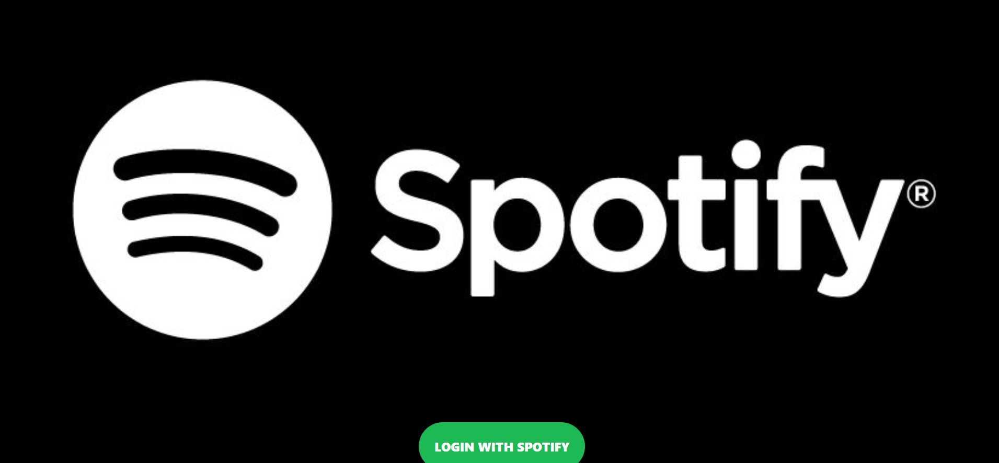
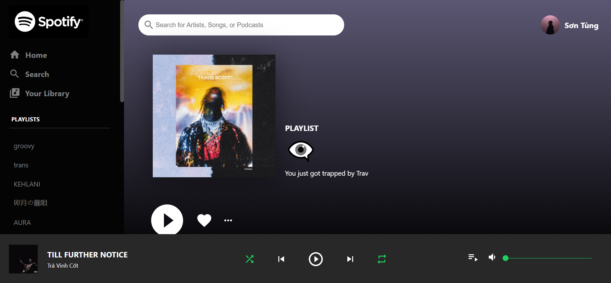
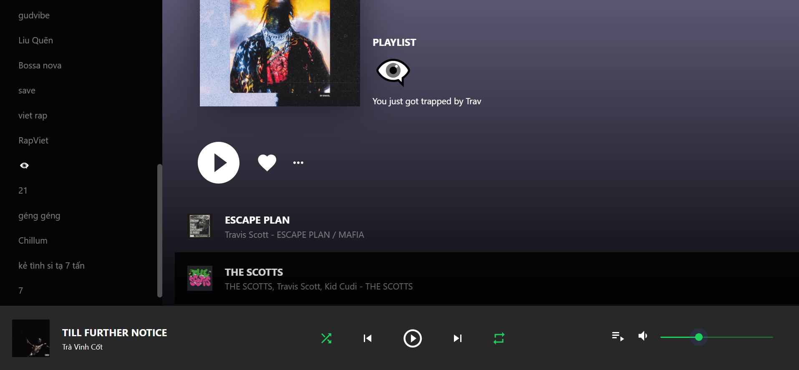

# Spotify Clone

A Spotify clone built with **React.js**, **Context API**, **Material-UI**, and **Spotify Web API**. This app allows users to authenticate with their Spotify accounts, view playlists, play songs, and control playback.

---

## Features

- **User Authentication:**
  - OAuth 2.0 login via Spotify.

- **Spotify API Integration:**
  - Fetch user data, playlists.
  - Display tracks on a playlist.

- **Dynamic UI:**
  - Responsive design with Flexbox.
  - Styled using Material-UI icons and custom CSS.

---

## Tech Stack

- **Frontend:** React.js, Context API
- **Styling:** Material-UI, CSS (Flexbox)
- **API:** Spotify Web API

---

## Setup Instructions

1. **Clone the Repository:**
   ```bash
   git clone https://https://github.com/hallo123hal/spotify-clone.git
   cd spotify-clone
   ```

2. **Install Dependencies:**
   ```bash
   npm install
   ```

3. **Spotify API Setup:**
   - Create a Spotify Developer account: [Spotify Developer Dashboard](https://developer.spotify.com/dashboard/)
   - Create a new app and copy the **Client ID**.
   - Set your **Redirect URI** to `http://localhost:3000/` in the Spotify Dashboard.

4. **Configure API Keys:**
   - Open `spotify.js`.
   - Replace the `clientId` with your own Spotify Client ID.

5. **Run the App:**
   ```bash
   npm start
   ```

---

## Project Structure

```
├── public/
├── src/
│   ├── App.js
│   ├── Player.js
│   ├── Sidebar.js
│   ├── Body.js
│   ├── Footer.js
│   ├── SongRow.js
│   ├── SidebarOptions.js
│   ├── Header.js
│   ├── Login.js
│   ├── DataLayer.js
│   ├── reducer.js
│   ├── spotify.js
│   ├── index.js
│   └── index.css
├── package.json
└── README.md
```

---

## Key Files

- **App.js:** Handles authentication and renders main player or login.
- **spotify.js:** Manages Spotify API authentication and token extraction.
- **DataLayer.js:** Sets up global state using Context API.
- **reducer.js:** Handles state updates (user info, playlists, etc.).
- **Player.js:** Main layout containing Sidebar, Body, and Footer.

---

## License

This project is for educational purposes and is not affiliated with Spotify.

---

## Screenshots







---

## Contact

For any queries or suggestions, feel free to reach out!

---
